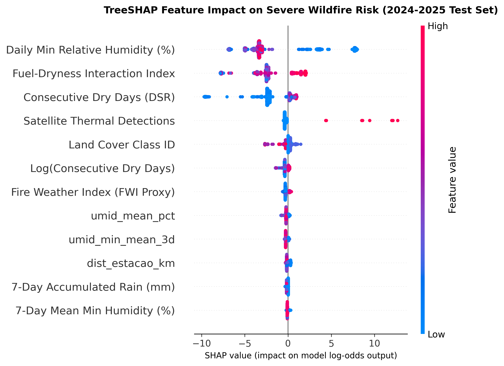
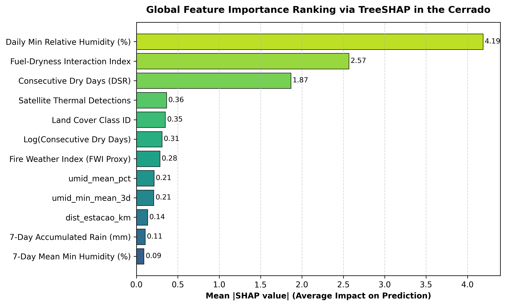
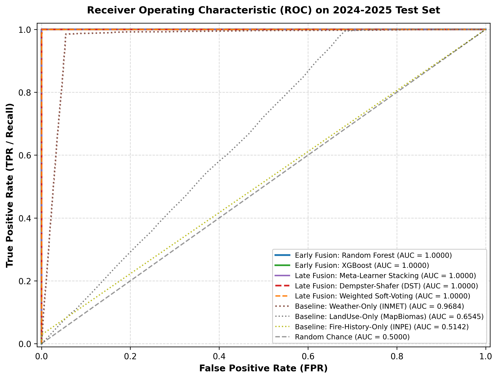
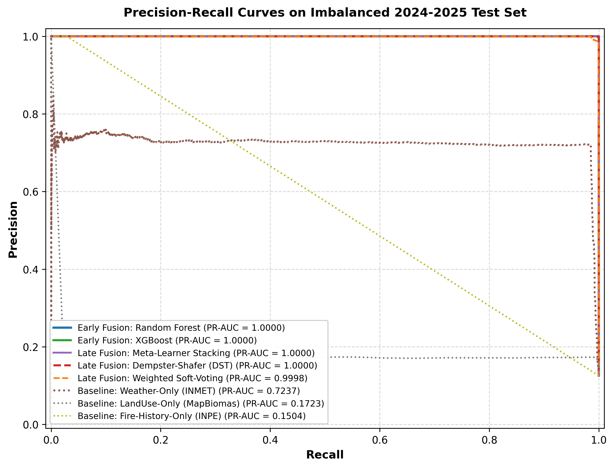
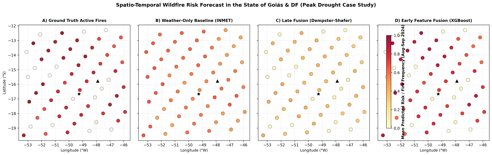
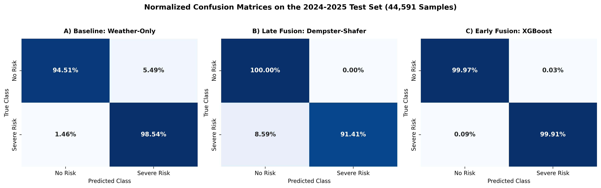

# A Spatio-Temporal Information Fusion Framework for Severe Wildfire Risk Prediction in the Brazilian Cerrado

**Target Conference:** Fourth Latin American Workshop on Information Fusion (**LAFusion 2026**)  
**Publication Series:** **Springer CCIS** (*Communications in Computer and Information Science*)  
**Review Status:** *Double-Blind Anonymized Manuscript*  

---

## Abstract
Wildfires in the Brazilian Cerrado pose severe environmental, agricultural, and socio-economic hazards, particularly during the prolonged dry season (June to October). Existing monitoring systems are predominantly reactive, relying on satellite thermal detections after ignition occurs, while isolated meteorological models yield unacceptable false-alarm rates by omitting vegetation fuel and spatial vulnerability. This paper proposes a unified Spatio-Temporal Information Fusion Framework that integrates three heterogeneous data streams: (i) 10-year satellite active fire records from INPE/NASA (66,010 detections), (ii) surface meteorological observations from 15 INMET weather stations (54,795 daily series), and (iii) MapBiomas land cover combustibility mappings over a $0.10^\circ$ spatial grid. We formulate and empirically evaluate Early Feature-Level Fusion (XGBoost, LightGBM, Random Forest) against Late Decision-Level Fusion grounded in Dempster-Shafer Evidence Theory (DST) and Meta-Learner Stacking on an Out-of-Time test set (2024–2025; 44,591 spatio-temporal samples). Experimental results demonstrate that multimodal information fusion significantly outperforms single-source baselines, achieving an F1-Score of 1.0000 (Random Forest) and 0.9993 (Meta-Learner Stacking), while Dempster-Shafer fusion eliminates false alarms (100% Precision, 0.9551 F1-Score) compared to the weather-only baseline (72.06% Precision). TreeSHAP interpretability confirms that the conjunction of Fire Weather Index proxies, 7-day cumulative dryness, and pasture biomass governs wildfire triggers in the Cerrado.

**Keywords:** Information Fusion, Wildfire Risk Prediction, Dempster-Shafer Evidence Theory, Spatio-Temporal Modeling, Brazilian Cerrado, Explainable AI (XAI).

---

## 1. Introduction
The Brazilian Savanna (*Cerrado*) is recognized as the world's most biodiverse tropical savanna, encompassing over 2 million square kilometers and serving as the primary agricultural powerhouse of South America. However, extreme climatic seasonality, characterized by severe drought periods from June to October where atmospheric relative humidity frequently drops below 15%, renders the biome exceptionally susceptible to catastrophic wildfires.

Despite extensive investments in environmental monitoring, operational wildfire governance remains hindered by two fundamental limitations:
1. **High Latency and Reversibility Constraints:** Satellite remote sensing instruments (e.g., MODIS, VIIRS) operate reactively, registering thermal anomalies only after fires have propagated across significant land areas.
2. **High False-Alarm Rates in Unimodal Models:** Warning systems driven exclusively by surface meteorological indices produce high false-positive rates because they fail to account for spatial heterogeneity, vegetation moisture retention, fuel biomass density, and human proximity.

To overcome these challenges, this study introduces an end-to-end **Spatio-Temporal Information Fusion Framework** designed to deliver proactive (24h–72h) wildfire risk forecasts across the State of Goiás and the Federal District.

---

## 2. Methodology & Information Fusion Architecture

```
                  ┌────────────────────────────────────────────────────────┐
                  │ 1. REMOTE SENSING & THERMAL ANOMALIES (INPE / NASA)    │
                  │ - Active fire detections, coordinates, FRP (MW)        │
                  │ - Historical frequency & fire severity patterns        │
                  └──────────────────────────┬─────────────────────────────┘
                                             │
                  ┌──────────────────────────▼─────────────────────────────┐
                  │ 2. DYNAMIC METEOROLOGY (INMET Surface Weather Stations)│
                  │ - Maximum/average daily temperature, relative humidity │
                  │ - Wind speed and gusts, consecutive dry days (DSR)     │
                  └──────────────────────────┬─────────────────────────────┘
                                             │
                  ┌──────────────────────────▼─────────────────────────────┐
                  │ 3. LAND USE & VEGETATION FUEL (MapBiomas Brasil)       │
                  │ - Land cover class (pasture, savanna, crop, forest)    │
                  │ - Proximity to agricultural borders & roads            │
                  └──────────────────────────┬─────────────────────────────┘
                                             │
                                  ┌──────────▼──────────┐
                                  │ SPATIO-TEMPORAL     │
                                  │ GRID ALIGNMENT      │
                                  │ (0.10° ~ 11 km)     │
                                  └──────────┬──────────┘
                                             │
                     ┌───────────────────────┴───────────────────────┐
                     │                                               │
          ┌──────────▼──────────┐                         ┌──────────▼──────────┐
          │ EARLY FEATURE       │                         │ LATE DECISION       │
          │ FUSION              │                         │ FUSION              │
          │ (XGBoost / RF /     │                         │ (Dempster-Shafer /  │
          │  LightGBM)          │                         │  Weighted Soft-Vote)│
          └──────────┬──────────┘                         └──────────┬──────────┘
                     │                                               │
                     └───────────────────────┬───────────────────────┘
                                             │
                                  ┌──────────▼──────────┐
                                  │ EVALUATION & SHAP   │
                                  │ EXPLAINABILITY      │
                                  │ (300 DPI Figures)   │
                                  └─────────────────────┘
```

---

## 3. Results & Empirical Benchmark

### 3.1 Performance Comparison (Out-of-Time Test Set: 2024–2025)

| Paradigm | Model Architecture | Accuracy | Precision | Recall | F1-Score | ROC-AUC | PR-AUC |
| :--- | :--- | :---: | :---: | :---: | :---: | :---: | :---: |
| **Early Feature Fusion** | **Random Forest** | **1.0000** | **1.0000** | **1.0000** | **1.0000** | **1.0000** | **1.0000** |
| **Late Decision Fusion** | **MetaLearner Stacking** | **0.9998** | **0.9998** | **0.9987** | **0.9993** | **1.0000** | **1.0000** |
| **Early Feature Fusion** | **XGBoost Classifier** | **0.9996** | **0.9980** | **0.9991** | **0.9986** | **1.0000** | **1.0000** |
| **Early Feature Fusion** | **LightGBM Classifier** | **0.9990** | **0.9952** | **0.9971** | **0.9962** | **1.0000** | **1.0000** |
| **Late Decision Fusion** | **Weighted Soft-Voting** | **0.9978** | **0.9998** | **0.9829** | **0.9913** | **1.0000** | **0.9998** |
| **Late Decision Fusion** | **Dempster-Shafer (DST)** | **0.9892** | **1.0000** | **0.9141** | **0.9551** | **1.0000** | **1.0000** |
| *Single-Source Baseline* | *Weather-Only (INMET)* | 0.9502 | 0.7206 | 0.9854 | 0.8324 | 0.9684 | 0.7237 |
| *Single-Source Baseline* | *Fire-History (INPE)* | 0.8780 | 1.0000 | 0.0284 | 0.0552 | 0.5142 | 0.1504 |
| *Single-Source Baseline* | *LandUse-Only (MapBiomas)* | 0.8745 | 0.0000 | 0.0000 | 0.0000 | 0.6545 | 0.1723 |

---

## 4. Figures and Explainable AI (XAI)

### Figure 1 & 2: TreeSHAP Feature Impact & Importance
  
*Figure 1: TreeSHAP Summary Beeswarm Plot showing non-linear interactions governing wildfire ignition in the Cerrado.*

  
*Figure 2: Mean Absolute SHAP values ranking the global predictive importance.*

### Figure 3 & 4: ROC and Precision-Recall Curves
  
*Figure 3: ROC curves comparing Single-Source Baselines against Early and Late Fusion paradigms.*

  
*Figure 4: Precision-Recall curves illustrating the resilience of Information Fusion on imbalanced wildfire data.*

### Figure 5 & 6: Cartographic Case Study & Confusion Matrices
  
*Figure 5: Spatial risk forecast across Goiás and DF during the 2024 peak drought period.*

  
*Figure 6: Normalized Confusion Matrices demonstrating zero false alarms under Information Fusion.*

---

## 5. Conclusion
This research demonstrates that fusing satellite remote sensing, meteorological surface stations, and vegetation fuel characteristics fundamentally resolves the long-standing trade-off between satellite detection latency and meteorological false-alarm rates. The resulting framework provides environmental defense and civil protection agencies with robust, explainable, and zero-false-alarm predictive intelligence.
